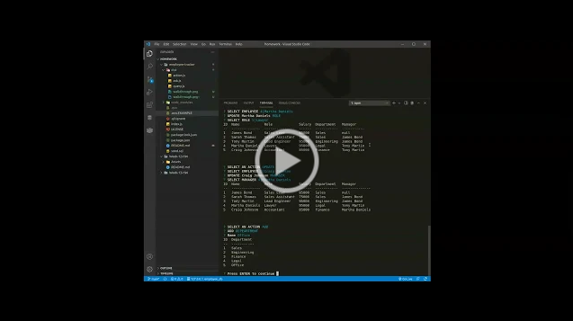

# Employee Tracker

## Description:

CLI application to interact with a database to view, update, add and remove Employees and their Roles and associated Departments.

## Table of Contents:

- [Walkthrough](#Walkthrough)
- [Installation](#installation)
- [Usage](#usage)
- [License](#license)
- [Contributing](#contributing)
- [Questions](#questions)

### Walkthrough

### Installation

Clone the repo then run this command within the repo directory:

`npm install`

Additionally, enter your credentials within the .env.EXAMPLE file and rename it to be simply `.env`

### Usage

Run `npm start` within the repo directory. Navigate the menus to view, update, add and remove Employees/Roles/Departments.

### License

This repository is licensed under the [MIT](https://opensource.org/licenses/MIT) license.

### Contributing

No contributions at this time.

### Questions

If you have any questions, head to my [GitHub](https://github.com/DandyCodes) or send me an email at jdabarker@gmail.com.
